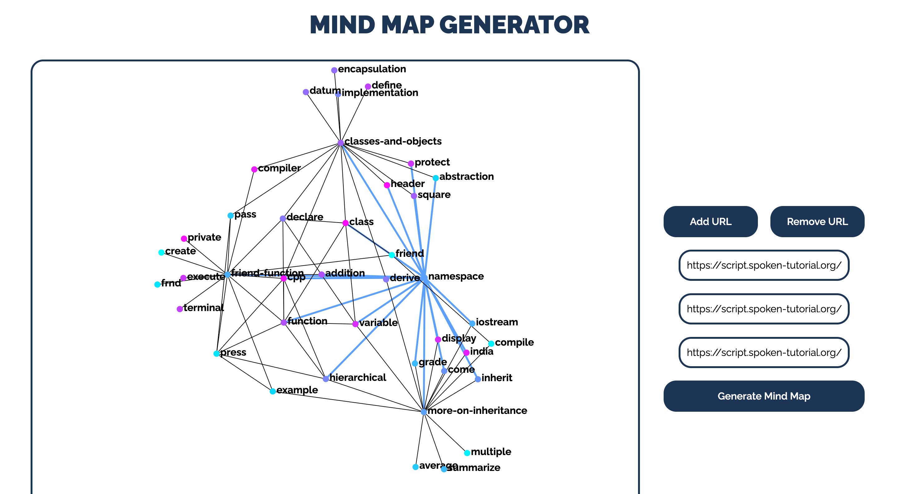
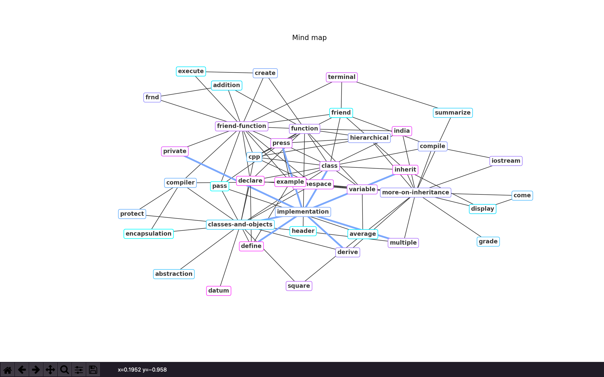

# mind_map_generator

### Introduction
This is a django app developed to generate mind maps from spoken tutorials. The URLs for the tutorial scripts need to be entered into the app, which would generate the mind map for those scripts

### Setting Up
There are 2 ways to use this application, either as a regular python script or a django app.

**Install the requirements**
```
python3 -m venv venv
source venv/bin/activate
pip install -r requirements.txt
```
**Run as a django app**
```
python manage.py runserver
```
**Run as a python script**
```
cd main_code
python main.py
```

### Examples
Click on any keyword to highlight it's relationship with other keywords

#### Django app
<p>

</p>

#### Python Script
<p>

</p>
